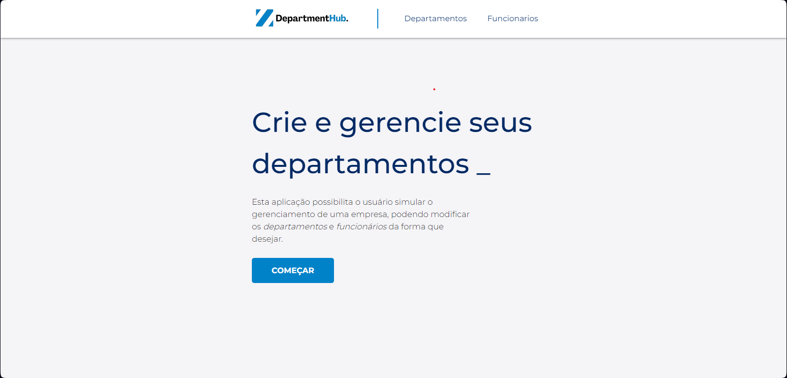

<h1 align="center">
  DepartmentHub
</h1>

<p align="center">
  
  
  
  
  
  
  <a href="https://github.com/Kaua-Cavalcante/blizzard/issues">
    
  </a>
</p>

<p align="center">
  
</p>

## 💻 Projeto

Esta aplicação possibilita o usuário simular o gerenciamento de uma empresa, podendo modificar os departamentos e funcionários da forma que desejar.

Dependências usadas no projeto:

-  [Angular](https://angular.io/)
-  [Angular Material](https://material.angular.io/)
-  [TypeScript](https://www.typescriptlang.org/)

## 📥 Instalação e execução

Faça um clone desse repositório e acesse o diretório frontend.

```bash
# Instalando as dependências
$ npm install
# Executanto aplicação
$ ng serve
```